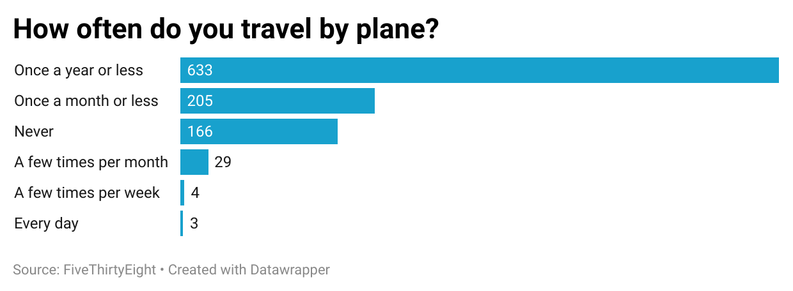

# Flying-Etiquette

## Why I picked the question "How often do you travel by plane" and found it interesting
I chose the question "How often do you travel by plane?" because it provides context for the remainder of the flying etiquette survey. How often people fly can often directly correlate to their various behaviors and choices about flying (for example, hypothetically someone who travels less frequently by plane might have children under 18 years old). 

## What this dataset shows and reveals
I found from this data set that the majority of people surveyed do not travel by plane frequently. The most common response consisting of approximately 60% of respondents was that they fly once a year or less. The percent of people that flew daily or montly was far less, with only 3 respondents flying daily and 4 respondents flying a few times per week out of a total of 1040 respondents. This reveals that most people do not travel by plane frequently.

## Graphical Representation of Data:

